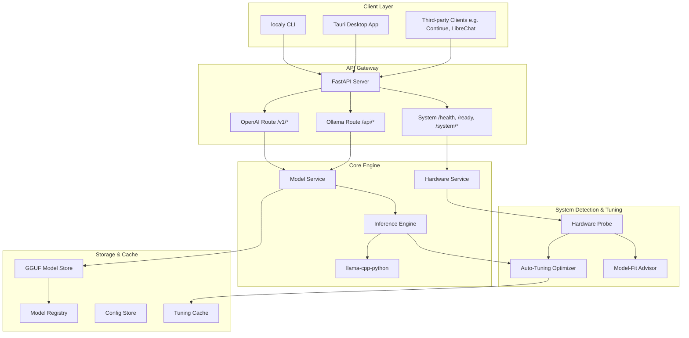

# Localy Architecture

Localy is a highly optimized, developer-friendly local LLM serving platform. Rather than rebuilding raw inference kernels, Localy functions as an intelligent orchestration layer on top of `llama.cpp` (via `llama-cpp-python`). It auto-detects host hardware topology, dynamically tunes performance settings, assesses model fit, and exposes standard APIs for third-party tools.

---

## System Overview

---

## 1. Phase 1: Speed Engine Core

The Core Engine is built in Python (3.12+) and is organized as follows:

### Hardware Detection (`localy.hardware`)
To optimize CPU-bound local inference, the hardware probe detects fine-grained resource constraints rather than generic attributes:
- **CPU Topology (`cpu_topology.py`)**: Uses Windows API calls (`GetLogicalProcessorInformationEx` via `ctypes`) to identify physical vs. logical cores and distinguishes **P-cores (Performance)** from **E-cores (Efficient)**. On non-hybrid architectures, it falls back to standard thread/core maps.
- **SIMD Capability (`instruction_sets.py`)**: Checks instruction sets (AVX2, AVX-512, SSE4.2, ARM NEON) using CPU registers to decide compilation and engine-side feature flags.
- **GPU Backends (`gpu_detector.py`)**: Discovers GPU platforms (CUDA, ROCm, Metal, Vulkan, OpenCL) and parses VRAM capacity. On systems with integrated graphics (e.g. Intel Iris Xe), it reports capabilities but marks them as `usable_for_inference=False` to prevent massive memory thrashing.
- **Memory & Storage (`memory.py`, `storage.py`)**: Inspects physical/available RAM and estimates storage read speed to recommend if memory-mapped files (`mmap`) are safe to use.

### Auto-Tuning Engine (`localy.tuning`)
The auto-tuning engine bridges the gap between hardware detection and inference parameters:
- **Optimizer (`optimizer.py`)**: Automatically computes thread bounds. It maps `n_threads` to the physical P-core count to prevent E-cores from bottlenecks, and sets `n_threads_batch` to physical core counts for parallel prompt processing.
- **Model-Fit Advisor (`advisor.py`)**: Approximates the final memory envelope of a model before downloading. It calculates:
  $$\text{Memory Needed} = \text{Model Weight Size} + \text{KV Cache Buffer} + \text{OS Overhead}$$
  If the model envelope fits within the `safe_model_budget_bytes`, it returns `fits_well`. If it exceeds but falls within swap limits, it flags `fits_tight`. Otherwise, it marks the model as `does_not_fit` and suggests smaller quantization profiles.
- **First-Run Benchmark (`benchmark.py`)**: Executes standard warming and evaluation passes on first launch, collecting generation tokens/sec to build realistic user-facing performance predictions.

---

## 2. Phase 2: App & Server Gateway

Localy packages the core engine into a lightweight desktop application:

### API Server (`localy.main`, `localy.api`)
Exposes a FastAPI web server running locally (`127.0.0.1` binding only for security).
- **OpenAI Compatibility**: Routes `/v1/chat/completions` to standard OpenAI chat payloads, formatting streaming outputs as standard Server-Sent Events (SSE).
- **Ollama Compatibility**: Implements `/api/chat` and `/api/generate` to support NDJSON stream formats, enabling drop-in compatibility with frontend extensions (e.g. Continue, Llama Coder).
- **Model Lifecycle**: Maintains a single model instance in memory at any time to preserve memory on low-RAM systems. Subsequent model requests automatically unload the active model and load the requested one.

### Desktop Shell (Tauri v2)
Uses **Tauri v2** over Electron for the desktop wrapper.
- **Resource Efficiency**: Tauri consumes $\sim 40\text{--}80\text{ MB}$ of RAM compared to Electron's $150\text{--}400\text{ MB}$. This saving is allocated directly to the model's context window budget.
- **Sidecar Architecture**: Spawns the python backend as a background sidecar process, tracking its lifespan, intercepting console outputs, and handling port binds.

---

## 3. Phase 3: LAN Device Pooling (Compute Sharding)

When a model size exceeds local memory capability, Localy scales horizontally:

- **Auto-Discovery (`localy.pooling.discovery`)**: Uses multicast DNS (mDNS) via standard protocols to discover other Localy instances running on the local network.
- **Pipeline Parallelism (`localy.pooling.shard_planner`)**: Distributes model layers in a sequential pipeline across available devices. If Device A has 16GB RAM and Device B has 8GB RAM, Device A is assigned a larger slice of model layers.
- **gRPC Transport**: Transfers intermediate activation tensors between nodes over TCP/IP, compressing data to optimize throughput over typical Wi-Fi and Ethernet environments.

---

## 4. Phase 4: Internet-Wide Pooling (Scope)

Designed for future scale, Phase 4 separates remote pooling into two tiers:
- **Friends-Only Pooling (4a)**: Relies on WebRTC/libp2p for NAT traversal. Nodes are authenticated via private invite links. Since participants are known, security/abuse verification overhead is minimized.
- **Stranger Network Pooling (4b)**: A public-network tier requiring zero-trust validation of activation calculations, distributed ledger incentives, and complex peer reputation tracking. Treated as a separate future subsystem.

---

## Security Model

1. **Host Binding**: The web server binds explicitly to `127.0.0.1` by default. There is no external network exposure of the API ports unless explicitly configured.
2. **Local Processing**: Model weights, prompt inputs, and generation buffers remain entirely local to the user's filesystem and RAM.
3. **No Dynamic Code execution**: Model weight files (`.gguf`) are verified using SHA-256 hashes upon download to prevent arbitrary injection.
